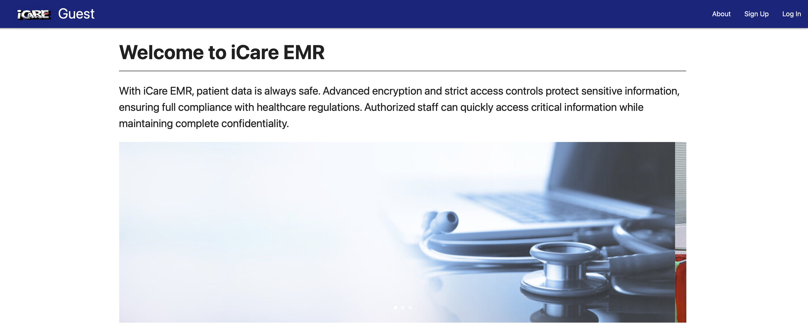

# iCare EMR System

With _**iCare System**!_ , patient data is always safe. Advanced encryption and strict access controls protect sensitive information, ensuring full compliance with healthcare regulations. Authorized staff can quickly access critical information while maintaining complete confidentiality.

The system is developed to serve Admin, Clerks, Nurses and Doctors to document and manage medical documentations for patients. This practice ensure the safety and accuracy of patient care. Also, it is an easy way to communicate among each others by giving and initiating orders by doctos to nurses.

---
🔗 [Live Demo](www.google.com)
---
## Application Guide

### Sign Up / Log In

- Create a new account and admin define the role for the new user either as a **Clerk** or **Nurse** or **Doctor**.
- Once Successfully account created, you can go through the app based on the privileges you have.
---

### ADMIN Login:

1. Edit Users Role based on the tasks asigned.
2. Validate the system functionality.
3. Delete an existing Patient

### Clerks Login:

1. Register new patient and edit patient details.
2. Book patient appointments to a particular doctor.
3. Edit, Update and Delete existing Appointment.

### Nurses Login:

1. View todays appointment patient list.
2. Add Nurses Note to today appointment patient.
3. Add, Update and Delete Vital Signs.
4. Add and Update Lab Results.
5. Print Patient Summary Report.
6. Add Alerts for patients.
7. Add Allergies for patients.

### Doctors Login:

1. View todays appointment patient list.
2. Add Doctor Notes to today appointment patient.
3. Add, Update and Delete Vital Signs.
4. Add, Update and Delete Lab Results.
5. Add, Update and Delete Prescriptions.
6. Add, Update and Delete Orders.
7. Add, Update and Delete Diagnosis.
8. Print Patient Summary Report.
9. Add Alerts for patients.
10. Add Allergies for patients.
11. Display Dcotor Dashboard with chart to visulaize daily statistics.

---

## Technologies Used in This Project

- _**Materialize for Styling and CSS**_
- _**Django**_ as Back-End Framework
- _**HTML**_ as Front-End Framework
- _**Postgres**_ as Database

---

## Project Reference Links:
1. [Link to Figma](https://www.figma.com/board/QEhzoD4vtPMV17gL1NfREd/iCare-Figma?node-id=0-1&t=LbnHouKxWNbuwylt-1)
2. [Link to ERD](https://lucid.app/lucidchart/136f155d-0d17-456a-a62a-6d3f405c85a6/edit?viewport_loc=-2877%2C-789%2C3900%2C2271%2C0_0&invitationId=inv_7a794c36-45a0-4fb5-8472-9b143786959a)
3. [Link to Trello](https://trello.com/b/Y7xSL7rL/icare)
4. [Live Demo](www.google.com)

## Future Enhancements

I have one main future goal, which is:
- _**Mobile App**_ : Develop a mobile application that has all the features for remote use.
- _**Payment Integration**_ : Enable hospital to accept payments from the patients.

> I really enjoy developing this application, it starts nourish our skills to develop web applications that could be utiltize and I hope you all get benefit from it!!!
